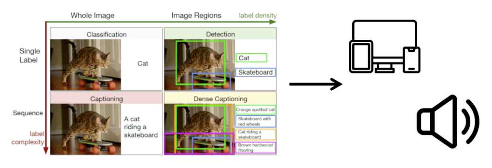
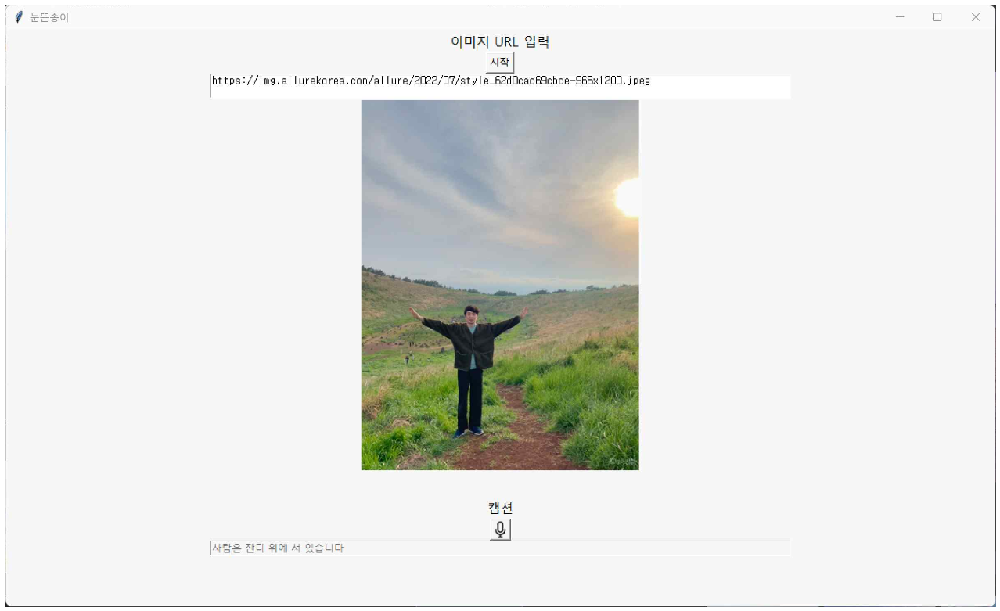
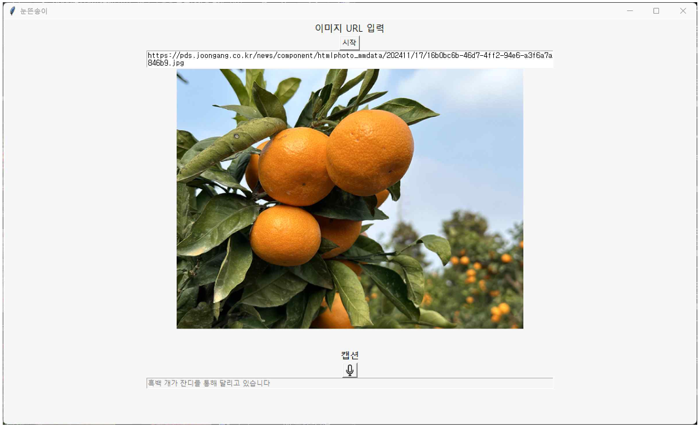

# Image Captioning and Speech Output System for the Visually Impaired  🧑‍🦯

1. [Project Background](#1-project-background)
2. [Project Objective](#2-project-objective)
3. [Project Description](#3-project-description)
4. [Project Results](#4-project-results)
5. [Installation](#5-installation)
6. [How to Run](#6-how-to-run)
7. [Languages & Frameworks](#7-languages--frameworks)
8. [Team Members](#8-team-members)

<br/>

-----

<br/>

## 1. Project Background

With the advancement of digitization and image processing technology, images are widely used as a more intuitive and effective medium for delivering information than text. 
In particular, at tourist attractions, visual elements play a key role in the overall experience and serve as the primary means of conveying information.

However, such visual content is often inaccessible to the visually impaired. In unfamiliar environments like tourist sites, it's especially difficult to understand and enjoy the surroundings using only auditory or tactile information. 
As a result, an alternative method for providing visual information to the visually impaired is needed.

<br/>

## 2. Project Objective



- Analyze the visual content of an image and generate natural language captions for the visually impaired.
- Output generated captions as speech for more intuitive and immediate information delivery.
- Provide a user-friendly GUI that allows users to obtain captions by simply entering an image URL.
- Support effortless interaction to make image captioning and audio output accessible with minimal steps.

<br/>

## 3. Project Description

- Automatically describe the content of images using a pre-trained deep learning model. (DenseNet201 + LSTM)
- Translate generated English captions into Korean for accessibility.
- Use TTS (Text-to-Speech) to convert the translated text into speech.
- Users simply enter an image URL into the GUI; the program automatically downloads the image → analyzes it → generates a caption → translates it → and outputs it as speech.
- The entire process is automated to improve information accessibility for the visually impaired.

<br/>

## 4. Project Results


<table>
    <tr>
        <td valign="top">
            
        </td>
        <td valign="top">
            
        </td>
    </tr>
    <tr>
        <td>Accurate caption is generated</td>
        <td>Inaccurate or abstract caption is generated</td>
    </tr>
</table>

<br/>

## 5. Installation

Clone the repository:

```bash
$ git clone https://github.com/bobbohee/smwu-image-captioning
```

Ensure you have Python 3.10+ installed, then install the required packages:

```bash
$ pip install -r requirements.txt
```

<br/>

## 6. How to Run

Launch the GUI application using the command below:

```bash
$ python gui.py
```

<br/>

### 사용 방법 

1. Run the program and enter an image URL.
2. Click the "Start" button to load the image, which will appear in the center of the screen.
3. A caption will be automatically generated and translated into Korean, then displayed below.
4. Click the speaker icon to hear the caption read aloud.

<br/>

## 7. Languages & Frameworks

| Category           | Tools & Technologies |
|--------------|----------------------|
| Language / Framework	 | Python 3.10+, TensorFlow (Keras API) |
| Model Architecture	 | DenseNet201 (CNN), Embedding Layer, Bidirectional LSTM |
| Data Preprocessing	 | Pandas, NumPy, Tokenizer, pad_sequences |
| Training Optimization	| Adam, EarlyStopping, ReduceLROnPlateau, ModelCheckpoint |
| User Interface (GUI)	 | tkinter              |
| Translation         | googletrans, deep_translator |
| Text-to-Speech (TTS)	 | gTTS                 |

<br/>

## 8. Team Members

- [@bobbohee](https://github.com/bobbohee): Park Bohee, Department of Library & Information Science, Sookmyung Women's University
- [@yumni-song](https://github.com/yumni-song): Song Yumin, Division of Artificial Intelligence Engineering, Sookmyung Women's University
- [@Limlim0208](https://github.com/Limlim0208): Lim Yumi, Division of Artificial Intelligence Engineering, Sookmyung Women's University
- [@Seoyoung0325](https://github.com/Seoyoung0325): Yoon Seoyoung, Division of Artificial Intelligence Engineering, Sookmyung Women's University
